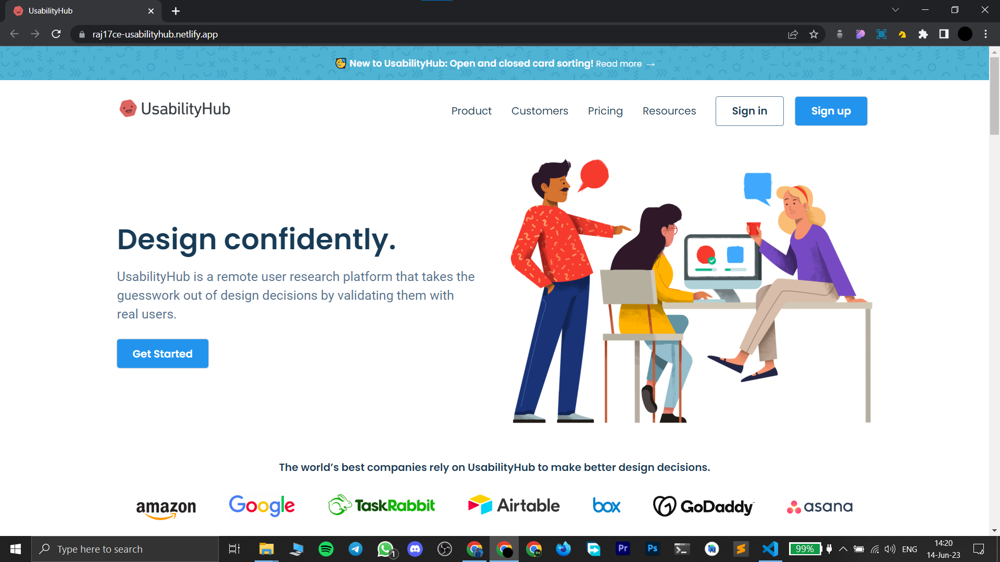

# UsabilityHub Clone

### [Live Link](https://raj17ce-usabilityhub.netlify.app)

#### This is a design clone of a famous website [usabilityhub.com](https://usabilityhub.com/) made using pure HTML and CSS.

## Functionalities

- A simple webpage made using HTML and CSS.

- Completely Responsive.

## Tech Stack

- `HTML` for making the layout of the webpage.

- `CSS` for styling the webpage.

- Modern features of `CSS` like flexbox and media queries are used in this project.

## Video Demo

Click on this thumbnail to watch the video.

## ScreenShot

 

